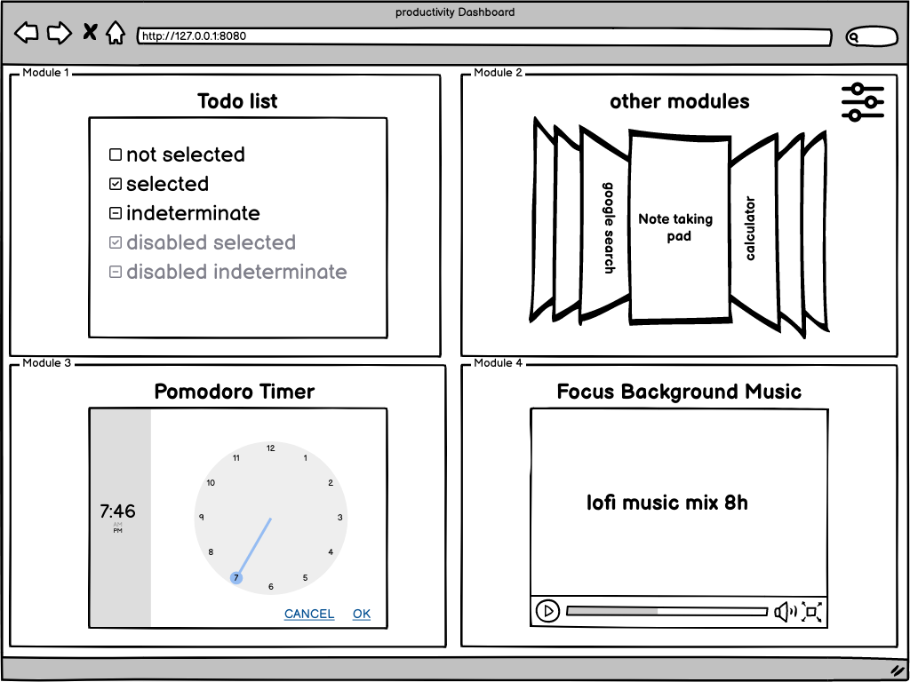

# Table of Content
- [Table of Content](#table-of-content)
  - [Short description](#short-description)
  - [Project Description](#project-description)
  - [Example View](#example-view)
  - [Requirements](#requirements)
  - [Getting Started](#getting-started)
    - [Frontend Stuff](#frontend-stuff)
    - [Backend Stuff](#backend-stuff)
  - [License](#license)
  - [Wireframes](#wireframes)
  - [Gitignore](#gitignore)

## Short description
---
A versatile and customizable productivity web app with interchangeable modules, designed to boost efficiency and optimize your workflow
<br>

## Project Description
---
1. Modular web app with four equal-sized sections for productivity-enhancing tools
2. Customizable and interchangeable modules for various use cases and user preferences. Module options planned:
    - pomodoro Timer
    - music player
    - simple todo list
    - simple markdown area for quick notes
    - calculator
    - google search bar
3. Simple task/note management for efficient organization
4. Expandability and flexibility for future module options and features
<br>

## Example View
---

<br>

TODO: Requirements and Getting Started Section need a rework. The current state is just a memory protocol of steps to be run, when starting the application locally.

## Requirements
---
To run this project, you'll need the following installed on your system:
- Node.js and npm (Node Package Manager): https://nodejs.org/
- Java Development Kit (JDK): https://adoptium.net/de/temurin/releases/?version=11
- [Angular CLI](https://github.com/angular/angular-cli/releases): Install it globally by running 
```bash
npm install -g @angular/cli
```
- A Java IDE or code editor, such as Eclipse, **IntelliJ IDEA**, or Visual Studio Code
- [Spring Boot](https://spring.io/projects/spring-boot)
<br> 

## Getting Started
---
Follow these steps to set up and run the project:

Clone the repository to your local machine:
```bash
git clone https://github.com/TobiasSMI/SplitDashboard.git
```
### Frontend Stuff

1. Navigate to the Angular project directory and install the necessary npm packages:
```bash
cd <insert ng repo>/<insert ng directory>
npm install
```
2. Start the Angular development server:
```bash
ng serve --open
```
The Angular application should now start in default browser at `http://localhost:4200/`.

### Backend Stuff

1. Import the Spring Boot project into your preferred Java IDE
2. Start the Spring Boot application:
- From your IDE: Locate the main class and run it.

Your Spring Boot application should now be accessible at `http://localhost:8080/`.

-> You should now have the Angular frontend and Spring Boot backend up and running
<br>

## License
---
This project is licensed under the [Creative Commons Attribution-NonCommercial-ShareAlike 4.0 International License](LICENSE.md)
<br>

## Wireframes
---
Wireframes for this project were created using [Balsamiq Wireframes Cloud](https://balsamiq.cloud)
<br>

## Gitignore
---
Gitignore for this project were created using [Toptotal.com](https://www.toptal.com/developers/gitignore/api/intellij+all,git,visualstudiocode)
<br>